```mermaid
flowchart TD
    A[📧 Receive Excel Report] --> B[📂 Open Report]
    B --> C[📊 Summary Sheet<br/>• Total screened<br/>• OK/Review/NOK<br/>• Date & OFAC version]
    C --> D[📋 Details Sheet<br/>• All results<br/>• Match reasoning]
    D --> E{Questions?}
    E -->|No| F[✅ Audit Complete]
    E -->|Yes| G[📞 Contact Compliance Officer]
    G --> H[Reference screening_id]
```

# UX Design Specification OFAC

**Author:** Carlos
**Date:** 2025-12-09

---

## Executive Summary

### Project Vision

OFAC Sanctions Screening Tools is a purpose-built compliance solution for small-to-medium humanitarian NGOs conducting low-frequency, high-stakes screening. The tool replaces a 6-8 hour manual process with a streamlined 15-minute workflow, providing "sleep at night" confidence through transparent fuzzy matching, country-aware scoring, and audit-ready documentation.

**Core Value Proposition:** Affordable, transparent, auditable alternative to enterprise compliance tools—built by practitioners for practitioners.

### Target Users

**Primary User: Carlos Martinez - Compliance Officer**
- Technical comfort: Mid-to-low (comfortable with Excel, intimidated by CLI)
- Role: Wears multiple hats (Finance Director + Compliance + Grant Review)
- Workflow: 3-5 grant rounds/year, 50-100 organizations per batch
- Core need: Confidence that no sanctioned entity was missed
- Pain points: Mind-numbing manual screening, compliance anxiety, documentation gaps

**Secondary Users:**
- Program Officers (quick ad-hoc checks)
- Executive Director (summary statistics for board)
- External Auditors (compliance documentation review)
- Legal Counsel (REVIEW/NOK case interpretation)

### Key Design Challenges

1. **Trust & Confidence** - Users must believe the tool caught everything; requires visible transparency in matching logic, scores, and data versioning
2. **Non-Technical Accessibility** - Primary user has mid-to-low technical comfort; interface must be intuitive with no jargon or complex configurations
3. **Exception Triage Workflow** - 2-5% of screenings require manual review; must surface all relevant context for quick decision-making
4. **Audit-Ready Professionalism** - Reports reviewed by external auditors; must project credibility comparable to commercial tools
5. **Data Freshness Anxiety Balance** - Must communicate OFAC data age without creating unnecessary anxiety

### Design Opportunities

1. **"Aha!" Moment Amplification** - First successful batch screening transforms 6+ hours into 15 minutes; design should celebrate this transformation
2. **Fuzzy Match Transparency** - Explaining WHY something matched (not just that it did) builds trust and demonstrates value
3. **Humanitarian Intelligence Differentiation** - General License context flagging is unique; visually differentiate this capability
4. **Professional Credibility** - Design quality projects trustworthiness to boards, auditors, and potential commercial customers
5. **Zero-Training Adoption** - Obvious workflow enables productive first use without documentation or training

## Core User Experience

### Defining Experience

The OFAC Sanctions Screening experience is defined by a streamlined batch workflow that transforms a 6-8 hour manual process into a 15-minute automated screening session.

**Core Loop:**
Upload File → Configure (auto) → Screen → Review → Export Report

**Critical Interaction:** Match transparency - when entities are flagged REVIEW or NOK, users immediately understand WHY and have all context needed for decision-making. This single interaction defines trust in the entire system.

**Primary Use Pattern:** Batch screening of 50-100 organizations during grant rounds (3-5 times per year), with occasional ad-hoc single-entity checks between cycles.

### Platform Strategy

| Platform | Priority | Purpose | Timeline |
|----------|----------|---------|----------|
| FastAPI Backend | Core | API-first architecture enabling all frontends | Phase 1 |
| Streamlit Web App | Primary | Batch screening interface for compliance officers | Phase 1 |
| Excel UDF | Secondary | In-spreadsheet ad-hoc checks via `=OFAC_CHECK()` | Phase 1.5 |
| Commercial SaaS | Future | Multi-tenant deployment with authentication | Phase 2 |

**Interaction Context:**
- Desktop web application (mouse/keyboard primary)
- No mobile optimization required (compliance work is desktop-based)
- Online connectivity required (OFAC data updates)
- No offline functionality needed

### Effortless Interactions

| Interaction | Design Goal |
|-------------|-------------|
| File Upload | Drag-drop with automatic column detection; no format specifications needed |
| Column Mapping | Smart defaults with preference memory; zero configuration for returning users |
| Batch Screening | Single click to process entire file; no per-row actions required |
| Result Interpretation | Inline explanations with visible confidence scores; no external lookups needed |
| Report Export | One-click professional output; audit-ready without modification |
| OFAC Data Management | Automatic freshness check on startup; one-click update when available |

### Critical Success Moments

1. **First Successful Screening** - User realizes 6+ hours of work completed in 15 minutes; design celebrates this transformation
2. **All-Green Results** - Visual confirmation of compliance; satisfying, unambiguous "you're clear" moment
3. **Fuzzy Match Discovery** - System catches spelling variation user would have missed; builds trust through demonstrated value
4. **General License Intelligence** - Syria + humanitarian context triggers GL-21 flag; differentiates from generic tools
5. **Auditor Handoff** - Report requires zero explanation or modification; projects organizational professionalism

**Make-or-Break Moments:**
- File upload failure or column detection miss creates immediate frustration
- Opaque match reasoning destroys trust in the system
- Reports requiring manual cleanup defeat the core value proposition

### Experience Principles

1. **Transparency Over Black Box** - Always show match reasoning, confidence percentages, and data versioning; users should never wonder "why was this flagged?"

2. **Batch-First, Single-Second** - Optimize all workflows for 50-100 organization batches; individual lookups are secondary use case

3. **Zero-Config Where Possible** - Smart defaults, automatic detection, and preference memory eliminate repetitive setup

4. **Audit-Ready by Default** - Every output suitable for external auditor review without modification or explanation

5. **Confidence Through Clarity** - Users should never question "did it work?" or "did I miss something?" - system state is always unambiguous

## Desired Emotional Response

### Primary Emotional Goals

**"Sleep at Night" Confidence** - The dominant emotion users should experience is confident reassurance. Carlos should feel genuinely certain that nothing was missed, the process is defensible, and documentation is complete. This transcends mere satisfaction—it's the specific relief of compliance anxiety eliminated.

**Supporting Emotional Goals:**
- **Trust** in the system's thoroughness and accuracy
- **Professional pride** when handing reports to auditors
- **Effortless competence** during the screening workflow

### Emotional Journey Mapping

| Stage | Desired Emotion | Design Trigger |
|-------|-----------------|----------------|
| First Discovery | "This is exactly what I needed" | Clear value proposition, no enterprise jargon |
| File Upload | Effortless, no anxiety | Drag-drop functionality, automatic column detection |
| During Screening | Calm anticipation | Progress indicator, reasonable time expectation set |
| Results Revealed | Relief + Validation | Predominantly green results, clear explanation of flags |
| Reviewing Exceptions | Informed confidence | All context in one place, clear next steps |
| Export/Handoff | Professional pride | Polished, audit-ready report appearance |
| Return Visit | Comfortable familiarity | Remembered preferences, no re-learning required |
| Error States | Supported, not stranded | Clear error messages, obvious recovery path |

### Micro-Emotions

**Emotions to Cultivate:**

| Target Emotion | Opposing State | UX Approach |
|----------------|----------------|-------------|
| Trust | Skepticism | Visible match scores, transparent reasoning, show the math |
| Confidence | Doubt | Display screening statistics ("X orgs screened against Y,Z00 entities") |
| Relief | Lingering anxiety | Explicit "screening complete" confirmation with summary |
| Control | Helplessness | Manual review options, override capability for edge cases |
| Competence | Confusion | Zero jargon interface, obvious workflow progression |
| Pride | Embarrassment | Professional-grade report design and export quality |

**Emotions to Actively Prevent:**

1. **"Did it work?" uncertainty** - System state must always be unambiguous; never leave users wondering about process completion
2. **"What does this mean?" confusion** - Every flag, score, and status includes inline explanation
3. **"This looks homemade" embarrassment** - Professional design quality projects organizational credibility
4. **"What if I missed something?" residual anxiety** - Explicit completion confirmation with screening statistics
5. **"I don't understand the score" opacity** - Full transparency in match reasoning and confidence calculations

### Design Implications

| Emotional Goal | UX Design Requirement |
|----------------|----------------------|
| Confidence | Visible OFAC data version, screening timestamp, entity counts |
| Trust | Match reasoning displayed inline, not hidden behind clicks |
| Relief | Clear "Complete" state with summary statistics |
| Control | Review/override options for flagged entities |
| Competence | Maximum 3-step workflow, progressive disclosure |
| Pride | Report design quality comparable to commercial compliance tools |

### Emotional Design Principles

1. **Transparency Builds Trust** - Never hide decision-making logic; users who understand the system trust the system

2. **Completion Creates Relief** - Every workflow ends with unambiguous confirmation; no lingering "did I do this right?" doubt

3. **Professional Quality Projects Confidence** - Visual design quality signals system reliability; if it looks polished, it feels trustworthy

4. **Context Prevents Confusion** - Every piece of information appears with its explanation; users never need to look elsewhere

5. **Explicit Over Implicit** - State changes, completions, and warnings are announced clearly; nothing important happens silently

## UX Pattern Analysis & Inspiration

### Inspiring Products Analysis

#### Sanctions.io (Direct Competitor)

**Strengths:**
- Purpose-built for sanctions screening (not generic compliance)
- Clear "search → results" mental model
- Professional appearance appropriate for compliance context

**Gaps (Our Opportunities):**
- "Very basic" interface with limited transparency in matching logic
- Black-box results without visible confidence scores
- No humanitarian context intelligence (General License awareness)
- Missing batch workflow optimization for low-frequency users

**Strategic Takeaway:** Differentiate through greater transparency in matching logic and intelligent humanitarian context detection.

#### Airtable (UI/UX Inspiration)

**What Makes It Work:**
- Clean data tables with information density that doesn't overwhelm
- Color-coded status indicators enabling instant visual scanning
- Generous whitespace providing breathing room and reducing cognitive load
- Soft, non-aggressive color palette
- Progressive disclosure revealing details when needed
- Inline interactions avoiding modal interruptions

**Transferable Patterns:**
- Results table with Airtable-style clarity and scannability
- Status pills with soft colors for OK/REVIEW/NOK states
- Expandable rows for match detail exploration
- Clean, inviting upload zone design

### Transferable UX Patterns

**Patterns to Adopt Directly:**

| Pattern | Source | OFAC Application |
|---------|--------|------------------|
| Status Pills | Airtable | Color-coded OK/REVIEW/NOK badges with soft colors |
| Expandable Rows | Airtable | Click row to reveal match details inline |
| Drag-Drop Upload | Universal | Clean upload zone with immediate visual feedback |
| Progress Indicator | Universal | Gentle, non-anxious progress bar during screening |
| Summary Cards | Airtable | Dashboard-style overview of screening results |

**Patterns to Adapt:**

| Pattern | Adaptation Strategy |
|---------|---------------------|
| Airtable's dense tables | Simplify for single-purpose screening; fewer columns, larger text |
| Sanctions.io's search | Add batch upload as primary mode, single search as secondary |
| Data table filtering | Limit to status filter (OK/REVIEW/NOK) only; no complex query builders |

### Anti-Patterns to Avoid

| Anti-Pattern | Why Avoid | Alternative Approach |
|--------------|-----------|---------------------|
| Enterprise dashboard complexity | Overwhelming for occasional users (3-5 times/year) | Single-purpose screens with clear focus |
| Aggressive red for warnings | Anxiety-inducing; conflicts with "calm confidence" goal | Warm amber, soft coral for warnings |
| Modal dialogs for everything | Interrupts workflow flow; feels heavy | Inline expansion, slide-over panels |
| Tiny text and dense layouts | Eye strain; conflicts with "easy on eyes" goal | Generous spacing, readable font sizes |
| Black-box confidence scores | Destroys trust; users can't verify results | Always show match reasoning inline |
| Information overload on first view | Cognitive overwhelm; defeats zero-training goal | Progressive disclosure; details on demand |

### Design Inspiration Strategy

**Aesthetic Direction: "Calm Confidence"**

The visual design should communicate "everything is under control" through:

| Principle | Implementation |
|-----------|---------------|
| Minimalist | Essential information only; complexity behind progressive disclosure |
| Calming Colors | Soft blues, muted greens, gentle grays; no aggressive primary colors |
| Easy on Eyes | High contrast for text, low contrast for backgrounds; ample whitespace |
| Peace of Mind | Visual design that projects competence and reliability |

**What to Adopt:**
- Airtable's clean table design and status pill patterns
- Airtable's progressive disclosure and inline expansion
- Universal drag-drop upload with immediate feedback
- Summary cards for at-a-glance result overview

**What to Adapt:**
- Simplify Airtable's flexibility for single-purpose screening use
- Extend Sanctions.io's basic approach with transparency and intelligence
- Reduce filtering complexity to essential status-based filtering only

**What to Avoid:**
- Enterprise complexity and dashboard sprawl
- Anxiety-inducing color choices (harsh reds, high-contrast warnings)
- Modal-heavy interaction patterns that interrupt flow
- Dense layouts that cause eye strain during extended use

## Design System Foundation

### Design System Choice

**Approach: "Tasteful Minimum" - Elegant Streamlit**

Given Phase 1's Streamlit platform and in-house deployment, we adopt a pragmatic design system that maximizes visual elegance while minimizing custom code overhead.

| Layer | Approach | Performance Impact |
|-------|----------|-------------------|
| Base | Streamlit native components | Zero overhead |
| Theme | Custom `config.toml` configuration | Zero overhead |
| Enhancement | Minimal targeted CSS (~10 lines) | Negligible |
| Custom Components | None for Phase 1 | N/A |

**Design Philosophy:** Elegant Streamlit, not Custom-Heavy Streamlit

### Rationale for Selection

1. **Performance Priority** - Custom CSS in Streamlit impacts load times; minimize for responsive experience
2. **Phase 1 Scope** - In-house deployment doesn't require commercial-grade visual polish
3. **Phase 2 Migration** - Simple Streamlit code enables clean future rewrite to React/commercial stack
4. **Development Speed** - Native components accelerate delivery without sacrificing professionalism
5. **Maintainability** - Less custom code means fewer breaking changes with Streamlit updates

### Implementation Approach

**Theme Configuration (`.streamlit/config.toml`):**

```toml
[theme]
primaryColor = "#4A90A4"              # Calm blue - actions, highlights
backgroundColor = "#FAFBFC"           # Soft off-white - main background
secondaryBackgroundColor = "#F0F2F5"  # Gentle gray - cards, sections
textColor = "#2D3748"                 # Soft dark gray - readable, easy on eyes
font = "sans serif"                   # Clean, accessible typography
```

**Status Color Palette:**

| Status | Background | Text | Emoji |
|--------|------------|------|-------|
| OK | `#C6F6D5` (soft green) | `#276749` | 🟢 |
| REVIEW | `#FEFCBF` (warm amber) | `#975A16` | 🟡 |
| NOK | `#FED7D7` (soft coral) | `#C53030` | 🔴 |

**Minimal CSS Injection:**

```css
/* Status badges - injected via st.markdown */
.status-ok { background: #C6F6D5; color: #276749; padding: 4px 8px; border-radius: 4px; }
.status-review { background: #FEFCBF; color: #975A16; padding: 4px 8px; border-radius: 4px; }
.status-nok { background: #FED7D7; color: #C53030; padding: 4px 8px; border-radius: 4px; }
```

### Customization Strategy

**What We Customize (High Impact, Low Effort):**

| Element | Method | Rationale |
|---------|--------|-----------|
| Color Palette | `config.toml` theme | Zero performance cost, defines visual identity |
| Status Badges | Minimal CSS (3 classes) | High visibility, defines app personality |
| Summary Stats | `st.metric` with theme colors | Native component, professional appearance |
| Results Table | `st.dataframe` with `column_config` | Native, performant, sortable |
| Match Details | `st.expander` | Native progressive disclosure |
| Alerts | `st.success`, `st.warning`, `st.error` | Theme-aware, zero custom code |

**What We Skip (Phase 2 Territory):**

| Element | Phase 1 Approach | Future Potential |
|---------|------------------|------------------|
| Expandable table rows | Detail view in expander below table | Custom React component |
| Animated transitions | None | CSS/Framer Motion |
| Custom icons | Emoji only (🟢 🟡 🔴 ✅ ⚠️) | Icon library integration |
| Complex layouts | Streamlit columns/containers | Full CSS Grid/Flexbox |

**Native Streamlit Components Used:**

- `st.file_uploader` - File upload with drag-drop
- `st.dataframe` - Results table with sorting/filtering
- `st.metric` - Summary statistics display
- `st.expander` - Progressive disclosure for details
- `st.columns` - Layout structure
- `st.progress` - Screening progress indication
- `st.success/warning/error` - Status messaging

## Defining Core Experience

### The Defining Experience Statement

**"Drop your Excel → See green/yellow/red results with reasons → Download your audit trail"**

This core interaction, if executed perfectly, makes everything else follow. Users will describe OFAC to colleagues as: "I upload my list, it shows me who's clear and who needs review, and I get my audit report."

### User Mental Model

**Current Workflow (Pain Point):**
1. Open OFAC website
2. Copy organization name from spreadsheet
3. Paste into search box
4. Wait for results
5. Record result somewhere (manually)
6. Repeat 50-100 times per grant round

**Expected Experience:**
- "I give it my list, it gives me results"
- "I can see why something was flagged"
- "I can hand the output to my auditor without editing"

**Key Insight:** The user's mental model is Excel-centric. Input is a spreadsheet, output should feel like a professional spreadsheet. The tool is a "spreadsheet processor" in their mind, not a "compliance system."

**What Users Love About Current Approaches:**
- OFAC's official site is authoritative and free
- Familiar search interface

**What Users Hate About Current Approaches:**
- One-at-a-time manual entry is tedious
- No way to process batches
- No audit trail generated automatically
- No visibility into matching logic

### Success Criteria

| Criterion | Success Definition |
|-----------|-------------------|
| Effortless Start | Drag file, columns detected automatically; zero configuration for repeat users |
| Clear Results | Instant visual understanding: mostly green, few yellow, rare red |
| Trust-Building Moment | User discovers system caught a fuzzy match they would have missed |
| Completion Clarity | Explicit summary: "87 organizations screened. 84 OK, 2 Review, 1 NOK" |
| Audit Confidence | Report export requires zero manual cleanup or explanation |

**Measurable Success Indicators:**
- ✅ First screening completed in under 5 minutes (vs. 6+ hours manual)
- ✅ User doesn't ask "what does this mean?" for any result
- ✅ Report handed to auditor without modifications
- ✅ User returns for next grant round without re-reading documentation

### Pattern Analysis

| Aspect | Pattern Type | Approach |
|--------|--------------|----------|
| File Upload | Established | Standard drag-drop, universally familiar |
| Column Detection | Slightly Novel | Auto-detect with confirmation (not manual mapping) |
| Results Table | Established | Sortable table with status colors (Airtable-inspired) |
| Match Transparency | Novel | Inline reasoning with confidence percentage |
| Humanitarian Context | Novel | GL-21 detection (unique differentiator) |
| Report Export | Established | One-click Excel download |

**Where We Innovate:**
- Match transparency - Show WHY something matched, not just THAT it matched
- Humanitarian intelligence - Context-aware flagging for General License applicability

**Where We Stay Familiar:**
- Upload, table view, and export all use established patterns users already understand

### Experience Mechanics

**Phase 1: Initiation**

| Step | User Action | System Response |
|------|-------------|-----------------|
| Open App | Navigate to URL | Display clean upload zone with clear call-to-action |
| Upload | Drag file or click to select | Accept file, show file name confirmation |

**Phase 2: Configuration (Automatic)**

| Step | User Action | System Response |
|------|-------------|-----------------|
| Column Detection | Review auto-detected columns | Highlight detected: Organization Name, Country, Purpose |
| Confirm | Click "Screen" button | Initiate screening with progress indication |

**Phase 3: Screening (Core Action)**

| Step | User Action | System Response |
|------|-------------|-----------------|
| Wait | Observe progress | Display: "Screening 47/87... Est. 30 seconds remaining" |
| Complete | View summary | Show: 🟢 84 OK │ 🟡 2 REVIEW │ 🔴 1 NOK |

**Phase 4: Review**

| Step | User Action | System Response |
|------|-------------|-----------------|
| Scan Results | View color-coded table | Display sorted by status (NOK first, then REVIEW, then OK) |
| Investigate | Click on flagged row | Expand to show match details, confidence %, match reasoning |
| Resolve | Mark as reviewed (optional) | Add note to audit trail for documentation |

**Phase 5: Export**

| Step | User Action | System Response |
|------|-------------|-----------------|
| Export | Click "Download Report" | Generate Excel with Summary and Details sheets |
| Complete | Save file | Display: "Report downloaded. Screening complete ✅" |

**Error Recovery:**

| Error State | User Experience |
|-------------|-----------------|
| Invalid file format | Clear message: "Please upload an Excel (.xlsx) or CSV file" |
| Missing columns | Prompt: "We couldn't find an organization name column. Please select one." |
| Network error during screening | Retain progress, offer retry without re-upload |
| OFAC data stale | Warning banner with one-click update option |

## Visual Design Foundation

### Color System

**Primary Palette - "Calm Confidence"**

| Role | Color Name | Hex Code | Usage |
|------|------------|----------|-------|
| Primary | Calm Blue | `#4A90A4` | Actions, buttons, links, highlights |
| Background | Soft Off-White | `#FAFBFC` | Main page background |
| Secondary BG | Gentle Gray | `#F0F2F5` | Cards, sections, input fields |
| Text Primary | Soft Dark Gray | `#2D3748` | Body text, headings |
| Text Secondary | Medium Gray | `#718096` | Captions, helper text |
| Border | Light Gray | `#E2E8F0` | Dividers, input borders |

**Semantic Status Colors**

| Status | Background | Text | Emoji | Usage |
|--------|------------|------|-------|-------|
| OK / Success | `#C6F6D5` | `#276749` | 🟢 | Clear screening results, success messages |
| Review / Warning | `#FEFCBF` | `#975A16` | 🟡 | Needs attention, data freshness warnings |
| NOK / Error | `#FED7D7` | `#C53030` | 🔴 | Screening issues, error states |
| Info | `#BEE3F8` | `#2B6CB0` | ℹ️ | Informational messages, tips |

**Color Application Principles:**
- Status colors always paired with emoji and text labels (never color-only)
- Soft, muted tones for backgrounds; darker tones for text
- Avoid harsh contrasts that create visual fatigue
- Warm amber instead of aggressive red for warnings

### Typography System

**Font Stack**

| Element | Font | Weight | Size | Line Height |
|---------|------|--------|------|-------------|
| Page Title | System sans-serif | Bold (700) | 28px | 1.2 |
| Section Heading | System sans-serif | Semi-bold (600) | 20px | 1.3 |
| Subsection | System sans-serif | Medium (500) | 16px | 1.4 |
| Body Text | System sans-serif | Regular (400) | 16px | 1.5 |
| Data Table | System sans-serif | Regular (400) | 14px | 1.4 |
| Status Labels | System sans-serif | Medium (500) | 12px | 1.2 |
| Helper Text | System sans-serif | Regular (400) | 14px | 1.4 |

**Typography Principles:**
- System sans-serif for fast loading and native feel
- Sufficient size hierarchy for clear visual scanning
- Generous line height for comfortable reading
- Data tables slightly smaller for information density

### Spacing & Layout Foundation

**Spacing Scale (8px base unit)**

| Token | Value | Usage |
|-------|-------|-------|
| xs | 4px | Tight spacing, icon gaps |
| sm | 8px | Related elements, input padding |
| md | 16px | Component internal padding |
| lg | 24px | Section separation |
| xl | 32px | Major section breaks |
| 2xl | 48px | Page-level spacing |

**Layout Structure**

| Property | Value | Rationale |
|----------|-------|-----------|
| Max content width | 1200px | Readable, focused |
| Main column | Full width | Simple single-column for Streamlit |
| Card padding | 16px | Comfortable internal space |
| Component gap | 16px | Consistent vertical rhythm |
| Mobile breakpoint | 768px | Tablet/phone adaptation (future) |

**Layout Principles:**
- Single-column layout for simplicity (Streamlit default)
- Generous whitespace for "calm" aesthetic
- Cards/containers for visual grouping
- Consistent vertical rhythm throughout

### Accessibility Considerations

**Color Contrast Compliance**

| Pairing | Contrast Ratio | WCAG Level |
|---------|---------------|------------|
| Text (#2D3748) on Background (#FAFBFC) | 11.5:1 | AAA ✅ |
| Primary (#4A90A4) on Background (#FAFBFC) | 4.6:1 | AA ✅ |
| Status text on status backgrounds | >4.5:1 | AA ✅ |

**Accessibility Requirements**

| Requirement | Implementation |
|-------------|---------------|
| Color Independence | Status always includes emoji + text, never color alone |
| Minimum Font Size | 14px minimum, 16px default |
| Touch/Click Targets | Minimum 44x44px for interactive elements |
| Focus Indicators | Visible focus states on all interactive elements |
| Screen Reader Support | Semantic HTML, proper ARIA labels where needed |
| Keyboard Navigation | All functions accessible via keyboard |

**Status Indication Pattern:**
```
🟢 OK (84)     - Color + emoji + label + count
🟡 REVIEW (2)  - Never rely on color alone
🔴 NOK (1)     - Accessible to colorblind users
```

## Design Direction Decision

### Design Direction: "Calm Professional"

A cohesive visual approach blending the "Calm Confidence" aesthetic with Airtable-inspired patterns, optimized for Streamlit's native component library. This direction prioritizes clarity, professionalism, and user confidence.

### Layout Architecture

**Primary Layout (Single-Column Flow):**

```
┌─────────────────────────────────────────────────────────┐
│  Header: Logo/Title + OFAC Data Freshness Indicator     │
├─────────────────────────────────────────────────────────┤
│  Upload Zone: Drag-drop file upload area                │
├─────────────────────────────────────────────────────────┤
│  Summary Metrics: OK | REVIEW | NOK counts              │
├─────────────────────────────────────────────────────────┤
│  Results Table: Color-coded screening results           │
├─────────────────────────────────────────────────────────┤
│  Details Expander: Match reasoning (when row selected)  │
├─────────────────────────────────────────────────────────┤
│  Actions: Download Report button                        │
└─────────────────────────────────────────────────────────┘
```

**Layout Rationale:**
- Single-column flow matches Streamlit's native behavior
- Top-to-bottom progression mirrors the workflow sequence
- Zero complexity in layout enables focus on content

### Component Design Decisions

| Component | Design Choice | Rationale |
|-----------|---------------|-----------|
| Status Indicators | Colored pills with emoji | Clear, accessible, scannable |
| Details View | Inline expander (not modal) | Less jarring, maintains context |
| Summary Display | Horizontal metric cards | Immediately scannable across |
| Data Freshness | Header badge | Always visible, consistent position |
| Progress Feedback | Linear progress bar | Non-anxious, clear progress |
| Export Action | Single prominent button | Clear next step, no decision fatigue |

### Information Hierarchy

**Primary Information (Always Visible):**
- Screening status summary (OK/REVIEW/NOK counts)
- Results table with status, organization, country
- OFAC data version and age

**Secondary Information (Progressive Disclosure):**
- Match details (confidence %, matched entity, reasoning)
- Country alignment analysis
- General License applicability
- OFAC entity ID and program

**Tertiary Information (In Reports):**
- Complete audit trail
- Screening timestamp and parameters
- Full OFAC data version information

### Visual Weight Calibration

| Aspect | Calibration | Implementation |
|--------|-------------|----------------|
| Color Saturation | Muted, soft | Status backgrounds at ~20% saturation |
| Contrast | High for text, low for backgrounds | Text #2D3748, BG #FAFBFC |
| Density | Medium | Readable without scrolling for typical batch |
| Whitespace | Generous | 16-24px between major sections |
| Visual Hierarchy | Clear 3-level | Title → Section → Detail |

### Interaction Patterns

**Hover States:**
- Table rows: Subtle background highlight
- Buttons: Slight darkening of primary color
- Links: Underline appears

**Click/Selection:**
- Table row click → Expander opens with details
- Status filter click → Table filters to that status
- Export click → Download initiates with confirmation

**Feedback Patterns:**
- Upload: File name appears, columns detected
- Screening: Progress bar with count and ETA
- Complete: Success message with summary
- Error: Warning banner with recovery action

### Design Rationale Summary

1. **Streamlit-Native** - Works entirely within Streamlit's component library; no fighting the framework
2. **"Calm Confidence" Execution** - Soft colors and generous spacing create professional, non-anxious experience
3. **Airtable Inspiration** - Table clarity, status pills, and progressive disclosure patterns
4. **Zero Customization Overhead** - Achievable with theme config + minimal CSS (as agreed in Phase 1 scope)
5. **Phase 2 Ready** - Clean, documented design language transfers to future React implementation

## User Journey Flows

### Journey 1: Batch Screening (Primary)

**User:** Carlos Martinez (Compliance Officer)
**Goal:** Screen 50-100 organizations for a grant round
**Frequency:** 3-5 times per year

**Flow Diagram:**

```mermaid
flowchart TD
    A[🏠 Open App] --> B{OFAC Data Fresh?}
    B -->|Yes ✅| C[📁 Upload Zone]
    B -->|Stale ⚠️| D[Show Warning Banner]
    D --> E{Update Now?}
    E -->|Yes| F[⏳ Updating OFAC Data...]
    E -->|Later| C
    F --> C
    
    C --> G[📄 Drag/Drop File]
    G --> H[🔍 Auto-Detect Columns]
    H --> I{Columns OK?}
    I -->|Yes| J[🚀 Click "Screen"]
    I -->|Adjust| K[Manual Column Selection]
    K --> J
    
    J --> L[⏳ Screening Progress<br/>47/87... Est. 30s]
    L --> M[✅ Screening Complete]
    
    M --> N[📊 Summary Display<br/>🟢84 🟡2 🔴1]
    N --> O[📋 Results Table]
    
    O --> P{Any REVIEW/NOK?}
    P -->|No 🎉| Q[📥 Download Report]
    P -->|Yes| R[🔍 Click Flagged Row]
    
    R --> S[📖 View Match Details<br/>• Entity matched<br/>• Confidence %<br/>• Reasoning]
    S --> T{Decision?}
    T -->|Clear| U[Mark as Reviewed]
    T -->|Escalate| V[Note for Legal]
    U --> W{More to Review?}
    V --> W
    W -->|Yes| R
    W -->|No| Q
    
    Q --> X[📁 Excel Report Downloaded]
    X --> Y[🎉 "Screening Complete ✅"]
```

**Key Moments:**
- Entry: Clean upload zone with clear call-to-action
- Progress: Visible count and time estimate during screening
- Results: Immediate summary with status counts
- Review: Inline match details for flagged items
- Completion: Explicit success confirmation with downloaded report

### Journey 2: Ad-Hoc Single Check

**User:** Program Officer
**Goal:** Quick pre-screening check on potential partner
**Frequency:** Ad-hoc, between grant rounds

**Flow Diagram:**

```mermaid
flowchart TD
    A[🏠 Open App] --> B[💡 "Quick Check" Mode]
    B --> C[⌨️ Type Organization Name]
    C --> D[🔍 Real-time Search]
    D --> E{Match Found?}
    E -->|No Match| F[🟢 "No matches found"]
    E -->|Match| G[🟡 Show Match Details]
    G --> H[📋 Display:<br/>• Entity name<br/>• List type<br/>• Confidence]
    F --> I[Done]
    H --> I
```

**Key Moments:**
- Entry: Simple text input, no file upload required
- Feedback: Real-time results as user types
- Result: Clear match/no-match indication with details

### Journey 3: Report Review (Auditor)

**User:** External Auditor
**Goal:** Review screening documentation for compliance audit
**Frequency:** Annual audit cycle

**Flow Diagram:**



**Key Moments:**
- Entry: Self-explanatory Excel report received via email
- Review: Summary sheet provides at-a-glance compliance status
- Detail: Details sheet contains complete audit trail
- Follow-up: Screening ID enables specific inquiry

### Journey Patterns

**Pattern 1: Progressive Disclosure**
- Show summary first, details on demand
- Use expanders and click-to-reveal
- Don't overwhelm with information upfront

**Pattern 2: Status-First Communication**
- Always lead with OK/REVIEW/NOK summary
- Color-coded status visible before details
- Enables quick triage of attention

**Pattern 3: Inline Explanation**
- Match reasoning appears in context
- No external lookups required
- User never asks "why was this flagged?"

**Pattern 4: One-Click Completion**
- Single button for report export
- No configuration or format selection
- Immediate download with confirmation

**Pattern 5: Graceful Error Recovery**
- Warnings don't block workflow
- Partial results on error (not total failure)
- Clear retry paths without data loss

### Flow Optimization Principles

| Principle | Implementation |
|-----------|---------------|
| Minimize Steps to Value | Upload → Screen → Results achievable in 3 clicks |
| Smart Defaults | Auto-detect columns, remember user preferences |
| Clear Progress Indication | Always show where user is in workflow |
| Non-Blocking Warnings | Data freshness warning allows proceeding |
| Graceful Degradation | Retain partial results on network/processing errors |
| Explicit Completion | Clear "done" state with summary and confirmation |

## Component Strategy

### Design System Components

**Approach: "Tasteful Enhancement"**

Leverage Streamlit's native components as the foundation, enhance with well-maintained community packages where they add clear value, and use minimal custom CSS for status indicators. This approach maximizes visual quality while maintaining zero technical debt.

### Component Tiers

**Tier 1: Native Streamlit (Zero Risk)**

| Component | Streamlit Widget | Usage |
|-----------|------------------|-------|
| File Upload | `st.file_uploader` | Excel/CSV upload with drag-drop |
| Data Table | `st.dataframe` | Results display with sorting, filtering |
| Metrics | `st.metric` | Summary statistics display |
| Progress | `st.progress` | Screening progress indication |
| Expander | `st.expander` | Progressive disclosure for match details |
| Columns | `st.columns` | Layout structure |
| Text Input | `st.text_input` | Quick check search |
| Buttons | `st.button`, `st.download_button` | Actions |
| Alerts | `st.success`, `st.warning`, `st.error`, `st.info` | Status messaging |
| Selectbox | `st.selectbox` | Column mapping selection |

**Tier 2: Streamlit-Extras (Low Risk, High Value)**

| Component | Package Function | Value Add |
|-----------|------------------|-----------|
| Colored Header | `streamlit_extras.colored_header` | Professional section headers with accent colors |
| Metric Cards | `streamlit_extras.metric_cards` | Enhanced metric styling beyond native st.metric |
| Switch Toggle | `streamlit_extras.switch_page_button` | Polished boolean toggles |
| Stateful Button | `streamlit_extras.stateful_button` | Better button state management |
| Bottom Container | `streamlit_extras.bottom_container` | Sticky footer for action buttons |

**Risk Assessment:** `streamlit-extras` is maintained by the Streamlit community, widely adopted, with stable APIs. Safe for production use.

**Tier 3: Optional Exploration**

| Package | Use Case | Risk Level | Decision |
|---------|----------|------------|----------|
| `streamlit-option-menu` | Navigation tabs | Low | Include if tabs needed |
| `streamlit-aggrid` | Advanced table features | Medium | Defer to Phase 2 |
| `streamlit-lottie` | Loading animations | Low | Defer to Phase 2 |

**Tier 4: Custom CSS (Minimal, Documented)**

Three status badge classes injected via single `st.markdown` call:

```css
.status-ok { 
  background: #C6F6D5; 
  color: #276749; 
  padding: 2px 8px; 
  border-radius: 4px; 
  font-weight: 500;
}
.status-review { 
  background: #FEFCBF; 
  color: #975A16; 
  padding: 2px 8px; 
  border-radius: 4px; 
  font-weight: 500;
}
.status-nok { 
  background: #FED7D7; 
  color: #C53030; 
  padding: 2px 8px; 
  border-radius: 4px; 
  font-weight: 500;
}
```

### Component Implementation Patterns

**Pattern 1: Status Summary Display**

```python
from streamlit_extras.metric_cards import style_metric_cards

col1, col2, col3 = st.columns(3)
with col1:
    st.metric("🟢 OK", 84)
with col2:
    st.metric("🟡 Review", 2)
with col3:
    st.metric("🔴 NOK", 1)

style_metric_cards()  # Enhanced styling from streamlit-extras
```

**Pattern 2: Section Headers**

```python
from streamlit_extras.colored_header import colored_header

colored_header(
    label="Screening Results",
    description="Review flagged organizations below",
    color_name="blue-70"
)
```

**Pattern 3: Match Details Expander**

```python
with st.expander(f"🔍 {org_name} - Match Details"):
    col1, col2 = st.columns(2)
    with col1:
        st.write(f"**Matched Entity:** {matched_entity}")
        st.write(f"**OFAC List:** {list_type}")
    with col2:
        st.write(f"**Confidence:** {confidence}%")
        st.write(f"**Match Type:** {match_type}")
    st.write(f"**Reasoning:** {reasoning}")
```

**Pattern 4: Data Freshness Banner**

```python
if days_old > 7:
    st.warning(f"⚠️ OFAC data is {days_old} days old. Consider updating before screening.")
    if st.button("Update OFAC Data"):
        # Trigger update
```

### Implementation Roadmap

**Phase 1 MVP - Core Components**

| Priority | Component | Implementation |
|----------|-----------|----------------|
| P0 | File Upload | Native `st.file_uploader` |
| P0 | Results Table | Native `st.dataframe` with column_config |
| P0 | Status Summary | `st.metric` + `streamlit_extras.metric_cards` |
| P0 | Match Details | Native `st.expander` |
| P0 | Download Report | Native `st.download_button` |
| P1 | Section Headers | `streamlit_extras.colored_header` |
| P1 | Status Badges | Custom CSS (3 classes) |
| P1 | Progress Bar | Native `st.progress` |

**Phase 1.5 Excel UDF**

| Component | Implementation |
|-----------|----------------|
| `=OFAC_CHECK()` function | xlwings UDF, no UI components |

**Phase 2 SaaS (Future)**

| Approach | Components |
|----------|------------|
| React Frontend | Full custom component library |
| Migrate | Design language documented here |

### Dependencies

```txt
# requirements.txt additions for Phase 1
streamlit>=1.28.0
streamlit-extras>=0.3.0
```

### Technical Debt Assessment

| Category | Risk | Mitigation |
|----------|------|------------|
| Native Streamlit | None | Core framework |
| streamlit-extras | Low | Well-maintained, can remove if needed |
| Custom CSS | Minimal | 3 classes, documented, easy to modify |
| Third-party packages | None included | Deferred to Phase 2 |

**Total Custom Code:** ~15 lines of CSS
**Package Dependencies:** 1 additional (streamlit-extras)
**Maintenance Burden:** Minimal

## UX Consistency Patterns

### Button Hierarchy

| Type | Usage | Visual Style | Example |
|------|-------|--------------|---------|
| Primary | Main action that advances the workflow | Solid background, theme primary color (#4A90A4) | "🔍 Screen Organizations", "📥 Download Report" |
| Secondary | Alternative or supporting action | Outlined or lighter background | "🔄 Update OFAC Data" |
| Destructive | Action with significant consequences | Soft coral background, confirmation required | "Clear Results" |
| Disabled | Action currently unavailable | Grayed out, no hover effect, cursor: not-allowed | Any button when preconditions not met |

**Button Placement:**
- Primary actions positioned prominently, typically right-aligned or centered
- Secondary actions to the left of primary actions
- Destructive actions separated from positive actions

### Feedback Patterns

**Feedback Types:**

| Type | Trigger | Streamlit Component | Duration | Visual |
|------|---------|---------------------|----------|--------|
| Success | Operation completed successfully | `st.success` | Persistent until next action | 🟢 Green background |
| Warning | Attention needed but non-blocking | `st.warning` | Persistent until resolved | 🟡 Amber background |
| Error | Operation failed, action required | `st.error` | Persistent until resolved | 🔴 Coral background |
| Info | Contextual information or tips | `st.info` | Persistent | 🔵 Blue background |
| Progress | Long-running operation in progress | `st.progress` + text | Until complete | Progress bar with count |

**Message Format Standard:**
```
[Emoji] [Clear statement] [Action if applicable]
```

**Examples:**
- ✅ "Screening complete! 87 organizations processed."
- ⚠️ "OFAC data is 12 days old. Consider updating before screening."
- ❌ "Upload failed. Please use .xlsx or .csv format."
- ℹ️ "Tip: You can filter results by clicking a status card above."

### Empty and Loading States

| State | Context | Visual Design | Message |
|-------|---------|---------------|---------|
| Initial | No file uploaded | Prominent upload zone | "📁 Drop your Excel or CSV file here, or click to browse" |
| Processing | Screening in progress | Progress bar + count | "Screening 47/87 organizations... Est. 30 seconds remaining" |
| Empty Results | All organizations clear | Success visual | "✅ All clear! No OFAC matches found for any organization." |
| Partial Results | Some results, more processing | Progress + partial table | Show completed rows, continue processing |
| Error | Processing failed | Error banner + retry | Clear error message with recovery action |

**Loading State Principles:**
- Always show progress count (X/Y)
- Provide time estimate when possible
- Allow user to see partial results if available
- Never show blank screen without explanation

### Data Display Patterns

**Table Behavior:**

| Interaction | Behavior | Implementation |
|-------------|----------|----------------|
| Default Sort | Status column, NOK first | Pre-sorted before display |
| Column Sort | Click header to sort | Streamlit dataframe native |
| Status Filter | Click metric card | Filter table to that status |
| Row Selection | Click row | Expand details below or in sidebar |
| Scroll | Vertical scroll for long lists | Streamlit dataframe native |

**Detail Expansion:**
- Click on any row to expand match details
- Details appear in `st.expander` below table or in dedicated section
- Expanded view shows: matched entity, confidence %, match type, reasoning, OFAC entity ID

### Status Indicator Pattern

**Universal Status Display Format:**
```
[Emoji] [Label] ([Count])

🟢 OK (84)
🟡 REVIEW (2)
🔴 NOK (1)
```

**Status Rules:**
1. Always combine emoji + text label (never color alone)
2. Include count for summary views
3. Display order: NOK → REVIEW → OK (problems surface first)
4. Status colors consistent across all contexts (tables, badges, metrics)

**Status Color Mapping:**

| Status | Emoji | Background | Text | Meaning |
|--------|-------|------------|------|---------|
| OK | 🟢 | #C6F6D5 | #276749 | No match found, organization is clear |
| REVIEW | 🟡 | #FEFCBF | #975A16 | Potential match, manual review needed |
| NOK | 🔴 | #FED7D7 | #C53030 | High-confidence match, likely sanctioned |

### Action Confirmation Pattern

| Action | Confirmation Required | Rationale | Method |
|--------|----------------------|-----------|--------|
| Screen Organizations | No | Reversible via re-upload | Immediate execution |
| Download Report | No | Non-destructive, no data loss | Immediate download |
| Update OFAC Data | No | Improves data quality | Immediate with progress |
| Clear Results | Yes | Loses current screening data | Confirmation checkbox or button |
| Re-screen | No | Just re-runs with same file | Immediate execution |

**Confirmation UI (when required):**
```python
if st.checkbox("I understand this will clear all current results"):
    if st.button("Clear Results"):
        # Execute clear
```

### Form Input Patterns

**Column Mapping (when auto-detection fails):**

| Field | Input Type | Validation |
|-------|------------|------------|
| Organization Name Column | `st.selectbox` | Required, must select one |
| Country Column | `st.selectbox` | Optional, improves scoring |
| Purpose/Description Column | `st.selectbox` | Optional, enables GL-21 detection |

**Input Feedback:**
- Immediate validation feedback
- Clear error states with helpful messages
- Smart defaults based on column name detection

### Navigation Pattern

**Single-Page Application Flow:**

Given Streamlit's page model, OFAC uses a single-page progressive flow:

1. **Upload Section** - Always visible at top
2. **Results Section** - Appears after screening complete
3. **Details Section** - Expands on row selection

**No explicit navigation required** - user scrolls through workflow stages.

**Future Multi-Page (if needed):**
- Screening (main)
- History (past screenings)
- Settings (preferences, OFAC data management)

## Responsive Design & Accessibility

### Responsive Strategy

**Approach: Desktop-Optimized**

OFAC is designed primarily for desktop use, as compliance work happens at a desk. While the application will function on other devices, optimization efforts focus on the desktop experience.

**Device Priority:**

| Device | Priority | Optimization Level |
|--------|----------|-------------------|
| Desktop (1024px+) | Primary | Fully optimized |
| Tablet (768px-1023px) | Secondary | Functional, acceptable degradation |
| Mobile (<768px) | Not Required | Core functionality works, no specific optimizations |

### Breakpoint Strategy

**Desktop (1024px+):**
- Full-width layout up to 1200px maximum content width
- Side-by-side metrics display in horizontal row
- Full data table visible without horizontal scroll
- Comfortable reading without zooming
- All features fully accessible

**Tablet (768px - 1023px):**
- Single-column layout acceptable
- Metrics stack vertically if needed
- Data table may require horizontal scroll for full details
- Touch-friendly button sizes (native Streamlit)
- All core functionality accessible

**Mobile (<768px):**
- Not specifically optimized
- Core functionality works (file upload, results view)
- May require scrolling and zooming
- No custom mobile UI adaptations
- Acceptable degradation for occasional mobile access

**Streamlit Responsive Behavior:**
Streamlit provides automatic responsive handling:
- `st.columns` adapts to screen width automatically
- `st.dataframe` handles overflow with scroll
- Native components are touch-friendly
- No custom responsive code required for Phase 1

### Accessibility Strategy

**Target Compliance: WCAG 2.1 Level AA**

This is the industry standard for professional applications and is appropriate for internal tools and future commercial deployment.

**Accessibility Requirements:**

| Requirement | Standard | Implementation | Status |
|-------------|----------|----------------|--------|
| Color Contrast | WCAG AA (4.5:1 body, 3:1 large) | All text/background combinations verified | ✅ Designed |
| Color Independence | Never rely on color alone | Status uses emoji + text + color | ✅ Designed |
| Keyboard Navigation | All interactive elements reachable | Tab order, Enter/Space activation | ✅ Streamlit native |
| Screen Reader | Semantic structure, labels | Proper heading hierarchy, ARIA labels | ✅ Streamlit native |
| Focus Indicators | Visible focus on all elements | Browser default + theme enhancement | ✅ Streamlit native |
| Touch Targets | Minimum 44x44px | All buttons and interactive areas | ✅ Streamlit native |
| Text Scaling | Readable at 200% zoom | Relative units, flexible layout | ✅ Streamlit native |
| Motion | Respect prefers-reduced-motion | Minimal animations, no autoplay | ✅ By design |

**Accessibility by Design Decisions:**

1. **Status Indicators:** Always `[Emoji] [Label] ([Count])` format - accessible without color perception
2. **High Contrast Text:** Primary text #2D3748 on #FAFBFC background = 11.5:1 ratio (exceeds AAA)
3. **Clear Focus States:** All interactive elements show visible focus ring
4. **Semantic Structure:** Proper heading hierarchy (h1 → h2 → h3)
5. **Error Messages:** Clear, specific, actionable error text

### Testing Strategy

**Accessibility Testing:**

| Test Type | Tool/Method | Frequency | Responsibility |
|-----------|-------------|-----------|----------------|
| Automated Scan | Lighthouse Accessibility | Each release | Developer |
| Automated Scan | axe DevTools extension | Each feature | Developer |
| Keyboard Navigation | Manual Tab/Enter testing | Each feature | Developer |
| Screen Reader | NVDA (Windows) | Major releases | QA/Developer |
| Color Contrast | WebAIM Contrast Checker | Design phase | Designer |
| Zoom Testing | Browser 200% zoom | Each release | Developer |
| Color Blindness | Sim Daltonism or similar | Design phase | Designer |

**Responsive Testing:**

| Test Type | Method | Frequency |
|-----------|--------|-----------|
| Desktop Browsers | Chrome, Firefox, Edge, Safari | Each release |
| Viewport Sizes | Browser DevTools responsive mode | Each feature |
| Real Devices | Actual tablet if available | Major releases |

### Implementation Guidelines

**For Development Team:**

**Accessibility Implementation:**
1. Use semantic HTML elements (headings, lists, buttons - not divs for everything)
2. Include alt text for any images (minimal in this app)
3. Ensure form inputs have associated labels
4. Test keyboard navigation after each feature
5. Run Lighthouse accessibility audit before merging

**Responsive Implementation:**
1. Use Streamlit's native responsive components
2. Test on 1920px, 1440px, 1024px viewport widths
3. Verify table readability at minimum supported width
4. Ensure touch targets remain usable on tablet

**What Streamlit Handles Automatically:**
- Viewport adaptation
- Touch-friendly native components
- Keyboard navigation for standard widgets
- Focus management
- Screen reader compatibility for standard elements

**What Requires Attention:**
- Custom HTML/CSS injections must maintain accessibility
- Status badges need proper ARIA labels if using custom markup
- Any custom JavaScript must support keyboard interaction
